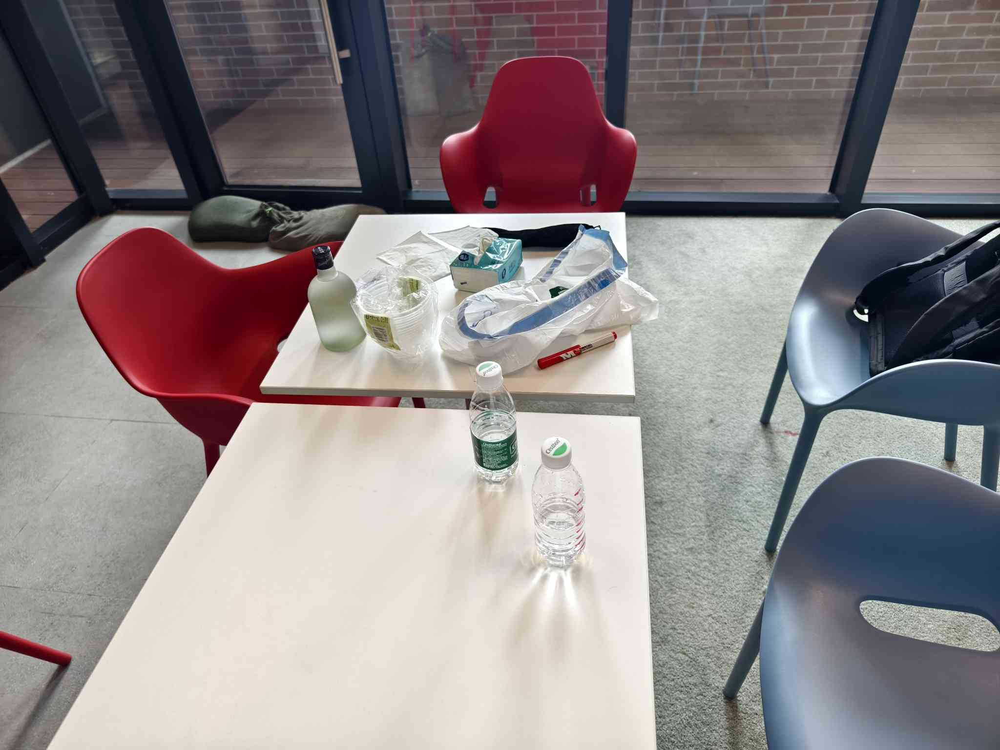
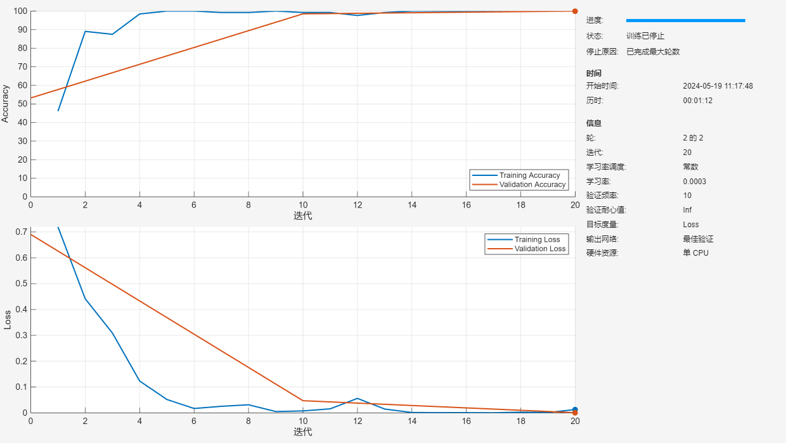
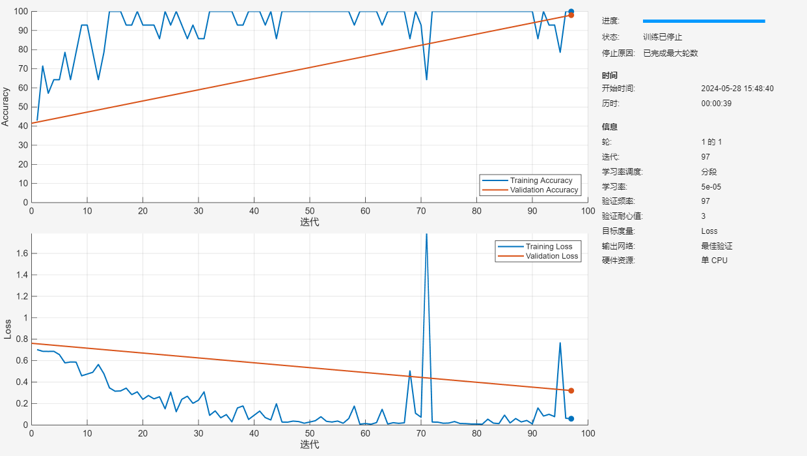
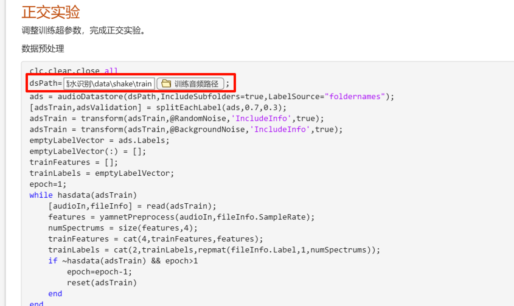
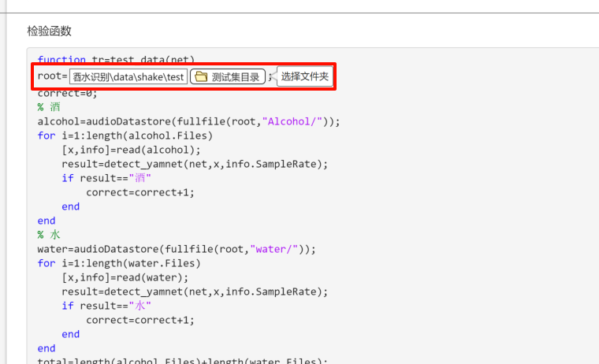

# YAMNET酒水识别

> 某南理工大学某械与汽车工程学院的数据科学（专硕，不知道有没有学硕的）的课程作业。使用机器学习识别酒和水，以及正交实验。本来正交实验想做另一个东西的，但是材料买不到了，就偷懒一起搞了。

## 介绍

利用MATLAB中预训练的yamnet对酒和水进行分类识别，并使用正交试验调参。

## 原理

> YAMNet是Yet Another Multilabel Audio Recognition Network的缩写，是一个深度学习模型，专门用于音频识别和分类任务。这个模型是由Google的研究人员开发的，它基于TensorFlow库，并且是开源的。YAMNet设计用于从音频剪辑中识别出存在的多个声音类别，因此它是一个多标签分类器。
> 
> ——来自通义千问

由于表面张力的不同，摇晃时酒比水更容易起泡，因此发出的声音是不一样的。利用MATLAB预定义的yamnet可以分辨出两者的区别。

> 正交试验是一种高效的实验设计方法，主要用于多因素多水平的实验研究中，目的是通过有限的实验次数确定哪些因素及因素的哪些水平组合对实验结果有显著影响，并评估这些影响的程度。这种方法尤其适用于探索因素之间复杂的相互作用，以及寻找最优的实验条件或产品配方。
> 
> 正交试验的核心工具是“正交表”，这是一种特殊设计的表格，能够系统地、均匀地覆盖所有因素与水平的组合，同时尽量减少实验的重复和冗余。正交表的特性确保了每个因素的每个水平与其他因素的每个水平大致等概率地结合，使得通过有限的实验就能获得全面而有效的信息。
> 
> ——来自通义千问

使用正交实验调整模型的参数，最大可能在不降低识别率的条件下提高训练速度。

我参考了MATLAB关于yamnet的官方文档，使用该文档提供的超参数训练的效果很好，对测试集有100%的准确率。不过因为我使用的电脑是集显的amd本，训练速度有点慢，调整参数后同样能达到100%的准确率，但训练速度提高了近一倍。

## 实验步骤

### 实验材料

- 某宝矿泉水两瓶
- 某北坊浓香白酒一瓶（400ml、40度量大管饱，不要998，只要9.8就能把它带回家！！！）
- 维沃手机一台



### 数据采集

用红色水笔在水瓶上标记好记号，把酒或水倒入瓶中直至刚好没过记号线，关闭瓶盖，按照广播体操的节奏手动摇晃，记录大约15s，重复30遍。

### 数据增强

采集了学校15个不同地点的背景噪声，用于与训练数据混合叠加，增加数据丰富度和提高鲁棒性。此外还把音频掐头去尾保留中间10s，降低数据量的同时，去除开头或结尾可能出现的采样空白。

### 训练

使用yamnet提供的预处理函数处理增强的音频后，开训！

### 正交实验

1. 选用4水平5因素正交表$L_{16}(4^{5})$，定义4个因素分别为`batch size`、`learning rate`、`dropout rate`、`learning rate drop fractor`，另外额外设置空白列。根据官方文档给定的参数，选取实验的参数范围如下所示，例如：`batch size`取值为5、8、11、14。
    ```matlab
    batch_size=[5 8 11 14];
    lr=[1e-5 5e-5 1e-4 5e-4];
    epoch=[1 2 3 4];
    dpr=[0.05 0.1 0.2 0.8];
    ```
2. 按照给定的正交试验表依次训练，得到训练时间`used_time`，并将测试集输入训练好的网络中预测得到准确率`true_rate`。
3. 把训练时间作为目标指标，按照错误率按比例提高训练时间，具体方式如下：
    ```matlab
    score=used_time.*(2-true_rate/100);
    ```
    这样如果失败率是a%，那么得分就是原来的训练时间×(1+a%)。
4. 处理得到各参数对应的平均时间矩阵`K`和极差`R`，从中可选出最佳参数组合和各参数对训练时间的影响因子：
   ```matlab
   输出：
    最好的组合是：
    BatchSize=14 (影响因子：31.1)
    LearningRate=1.0e-05(影响因子：12.2)
    Ephoch= 1(影响因子：76.6)
    DropFractor= 0.1(影响因子：6.1)
    其他因素的影响因子：5.1
    ```
    可见`epoch`对时间的影响排第一位，排第二的是`batchsize`，其他因素对训练时间的影响最小，因此排除了还有其他影响训练时间的参数还未找到的可能。
5. 其实使用正交试验表中提供的任何参数的组合计算得到的正确率都是100%。

### 修改超参数

根据正交试验修改超参数，再次训练，可以看到训练时间从1：12分钟变成了39s，提升近一倍，且测试集结果显示准确率仍为100%。但是可以看到修改后训练集的loss起伏较大，曲线不够理想。

另外修改前后train和validate的指标在大方向上都是一致的，说明没有过拟合（虽说数据量太小了说这个好像没啥意义。。。）





## 使用说明

本项目一共有6个`mlx`文件，下面解释其功能：

- `train.mlx`：训练模型并保存到`./net.mat`文件中。
- `OrthogonalExperiment.mlx`：正交实验，根据正交表训练模型，输出显示各参数影响因子和最佳参数组合。
- `RamdomNoise.mlx`：函数，为训练数据添加随机噪声。
- `BackgroundNoise.mlx`：函数，为训练数据添加背景噪声。
- `accuracy.mlx`：计算`train.mlx`输出的模型在测试集上的准确率。
- `tune.mlx`：播放声音预处理（添加背景噪声、白噪声等）效果，用于调整预处理参数。

1. 本项目需要安装matlab的音频处理工具箱和深度学习工具箱。
2. 下载yamnet模型，详见[MATLAB官方文档](https://www.mathworks.com/help/audio/ref/audiopretrainednetwork.html)。
3. （可选）下载训练和背景噪声数据：https://pan.baidu.com/s/1TUKR5I0EYEESozHb8yIu0A?pwd=tkrz 
    提取码：tkrz
4. 调整`train.mlx`, `OrthogonalExperiment.mlx`, `accuracy.mlx`和`tune.mlx`中的文件路径到指定位置，例如，对于`OrthogonalExperiment.mlx`，需要调整`dsPath`和`root`。



## 参考

- [MATLAB的audioPretrainedNetwork说明文档](https://www.mathworks.com/help/audio/ref/audiopretrainednetwork.html)
- 郑淙, 1992. 正交实验法简介. 昭通师专学报.
